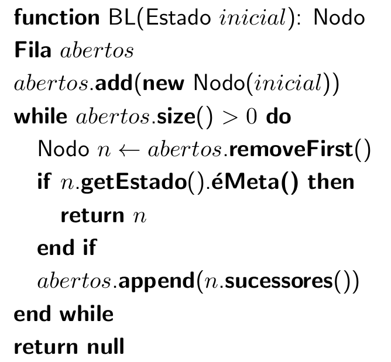
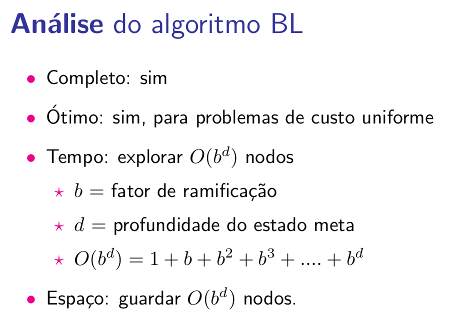
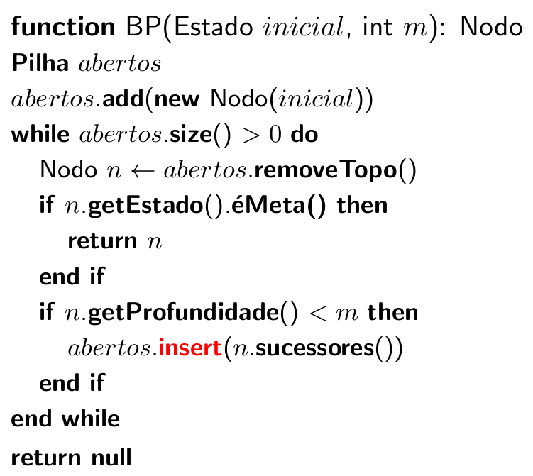
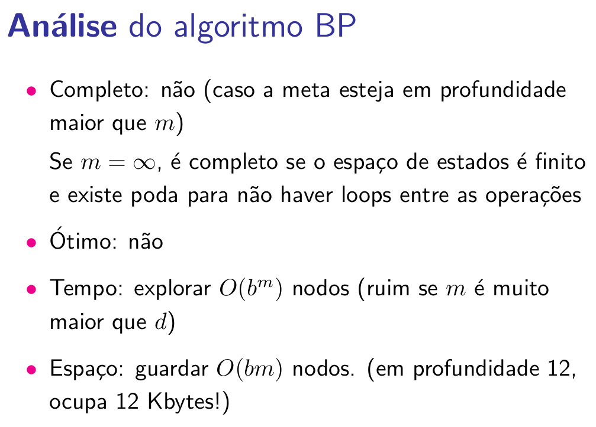
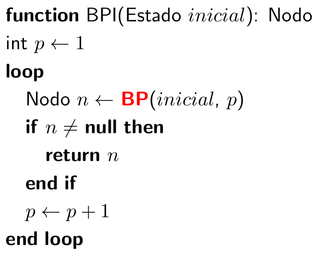
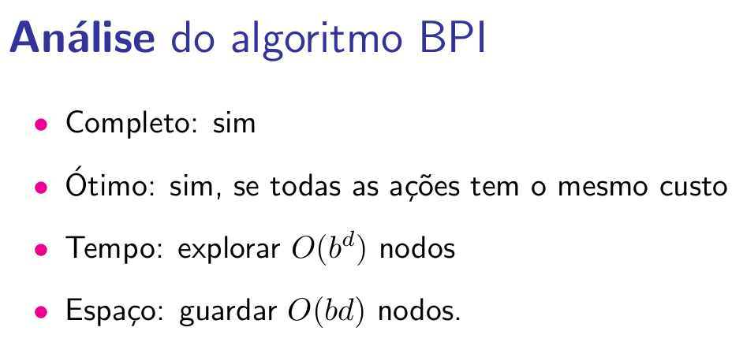
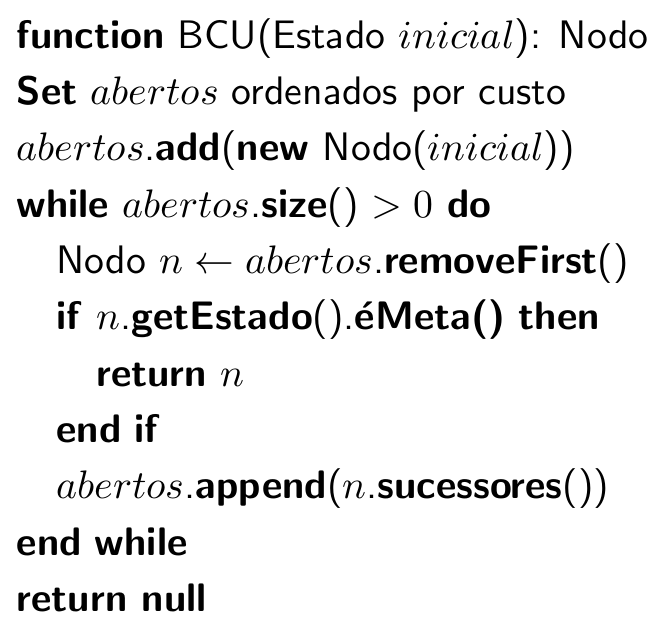
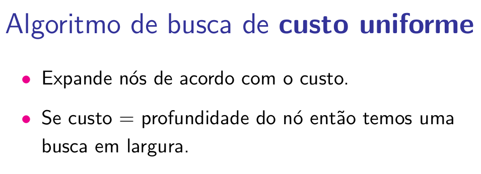
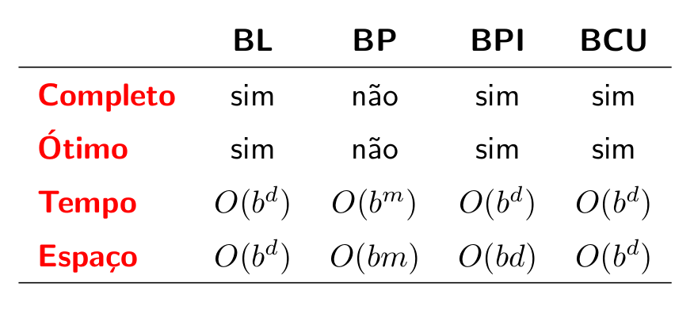

# Revisão sobre algoritmos de busca sistemáticos

## Algoritmo de busca em Largura

## Algoritmo de busca em Profundidade

## Algoritmo de busca em Profundidade Iterativa

## Algoritmo de busca de Custo Uniforme

## Resumo

??? warning "Vamos revisar as implementações do problema do aspirador de pó e da banda U2?"
    Agora ficou mais claro o funcionamento destas soluções? 

## Referências

<embed src="../../referencias/03_algoritmos_busca/busca_versaoFabricio.pdf" type="application/pdf" width="600" height="300">

