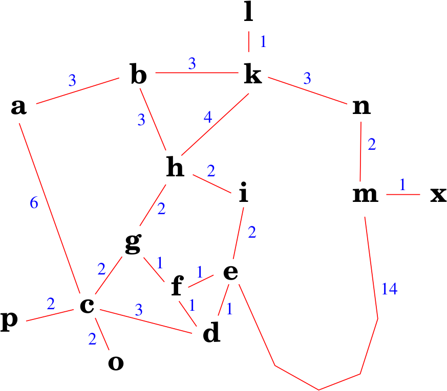

# Menor caminho entre duas cidades

Considere o mapa abaixo: 

Implemente um agente autônomo que consegue resolver este problema. Antes de iniciar a implementação, pense na resposta para as seguintes perguntas: 

* O que é relevante representar nos estados do mundo? Como os
    estados são estruturados (estrutura de dados) e qual o significado
    dela (dos campos)?
* Mostre como ficam representados os estados inicial e final
    segundo a representação adotada.
* Quais as operações sobre os estados?
    (detalhe como cada operação irá alterar os estados e quais as
    condições para cada operação ser executada)
* Qual a estimativa do tamanho do espaço de busca (número de
    estados possíveis)?
* Que algoritmo de busca pode ser utilizado para resolver este problema considerando que
a solução apresentada precisa ser ótima?

## Implementações

Implemente um agente, usando o algoritmo de busca em largura, para encontrar um caminho entre a cidade *i* e *o*. 

Perguntas:

* Qual foi o tempo de processamento até a implementação encontrar uma solução? 
* A árvore de busca gerada é "inteligente"? 
* A solução encontrada é ótima? 

Usando a mesma implementação, encontre um caminho entre a cidade *b* e *o*. 

Perguntas:

* Qual foi o tempo de processamento até a implementação encontrar uma solução? 
* A árvore de busca gerada é "inteligente"? 
* A solução encontrada é ótima?

## Usando o algoritmo de custo uniforme

Utilize o algoritmo de custo uniforme para encontrar uma solução para os problemas abaixo: 

* da cidade *i* para a cidade *o*
* da cidade *b* para a cidade *o*
* da cidade *i* para a cidade *x*

Perguntas:

* Qual foi o tempo de processamento até a implementação encontrar uma solução? 
* A árvore de busca gerada é "inteligente"? 
* A solução encontrada é ótima?

## Usando heurísticas para podar a árvore de busca

??? warning "O que é uma heurística?"
    O que é uma heurística? 

??? warning "Qual é a utilidade de uma heurística?"
    Qual é a utilidade de uma heurística? 

??? warning "Que heurística podemos usar no problema das cidades?"
    Que heurística podemos usar no problema das cidades? 
 

