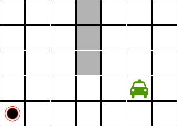
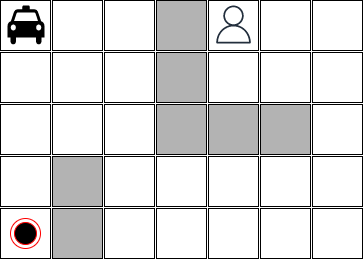
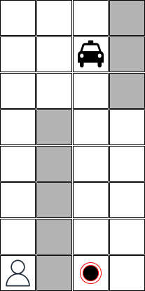
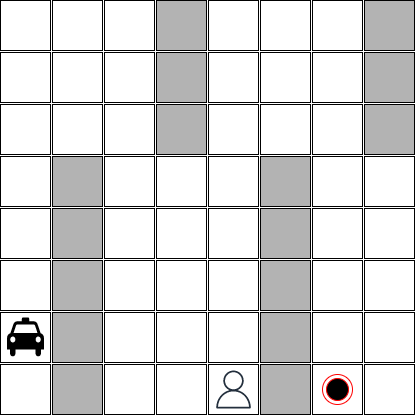

# Taxi Driver

Neste exercício você deverá implementar um agente *taxi driver*. Um agente que é capaz de definir uma sequências de ações para pegar um passageiro em uma posição e deixá-lo em outra possição no mesmo mapa - um mapa que possui obstáculos. 

Por exemplo, considere o seguinte mapa: 

Neste mapa: 

* o táxi está na posição [0,0], 
* o passageiro está na posição [0,5],
* o passageiro precisa ser levado para a posição [4,0], 
* o mapa tem 5 linhas e 7 colunas, e
* existem obstáculos no mapa que estão pintados em cinza.

Sabemos que o táxi sabe executar as seguintes ações: 

* ir para baixo;
* ir para cima;
* ir para esquerda;
* ir para direita; 
* pegar o passageiro, e;
* liberar o passageiro. 

Aspectos importantes sobre algumas ações: 

* a ação *pegar o passageiro* só pode ser executada se o táxi estiver vazio.

* a ação *pegar o passageiro* pode ser executada em qualquer posição do mapa. No entanto, só vai ter o efeito desejado se o táxi estiver na mesma posição que o passageiro. 

* a ação *liberar o passageiro* só pode ser executada se o táxi estiver com o passageiro. 

* a ação *liberar o passageiro* pode ser executada em qualquer posição do mapa. No entanto, só vai ter o efeito desejado se o táxi estiver na posição onde o passageiro precisa chegar.

Qual é a sequência de ações que o táxi precisa executar para pegar o passageiro e levar até o destino?

A solução implementada precisa ser capaz de tratar diversas configurações com diversas dimensões. Por exemplo, a figura abaixo ilustra uma configuração possível onde o táxi está pintado de verde porque ele está com o passageiro:

 

A imagem abaixo é um mapa com as mesmas dimensões, mas com um número maior de obstáculos: 

## Entrega do exercício

* Este exercício deverá ser feito por equipes com até 3 integrantes.
* O prazo máximo para entrega é 27/09/2022 (terça-feira) até às 18:00 horas.
* A entrega deverá ser feita via *Github Classroom*. 
* O link para o projeto template e para a entrega é [https://classroom.github.com/a/H0ys1-V_](https://classroom.github.com/a/H0ys1-V_).
* Cada equipe deverá entregar a implementação de um *taxi driver* e um arquivo de documentação (`taxi_driver_readme.md`).

## Questões que precisam ser respondidas na documentação do exercício

O arquivo `taxi_driver_readme.md` deve apresentar os nomes dos integrantes da equipe e deverá responder as seguintes perguntas: 

* O que é relevante representar nos estados do mundo? Como os
    estados são estruturados (estrutura de dados) e qual o significado
    dela (dos campos)?
* Mostre como ficam representados os estados inicial e final
    segundo a representação adotada.
* Quais as operações sobre os estados?
    (detalhe como cada operação irá alterar os estados e quais as
    condições para cada operação ser executada)
* Que algoritmo de busca foi utilizado para resolver este problema considerando que a solução apresentada precisa ser ótima e que deve ser processada na ordem de segundos, no máximo em poucos minutos?
* A equipe fez uso de heurísticas? Se sim, explique as heurísticas utilizadas.
* Quais são os limites da solução? A solução consegue tratar mapas com que dimensões? Quão complexo pode ser a estrutura de obstáculos? 

Todas as questões precisam estar respondidas para que a equipe tenha no mínimo nota **C** no trabalho como um todo. Se a equipe deixou de responder uma (1) ou duas (2) questões então a nota é **D**, caso contrário **I**. A documentação completa e coerente com a impĺementação é pré-requisito para que a equipe tenha no mínimo nota **C**.   

## Requisitos da implementação do taxi driver

A equipe deverá implementar no minímo dois arquivos: um arquivo python com a lógica do agente *taxi driver* e um arquivo de testes usando `pytest`. Qualquer entrega que não tenha os dois arquivos, o arquivo da solução e o arquivo de testes, terá nota **I**. 

* A configuração do mapa deve ser fornecida via arquivo texto. Deve ser um dos parâmetros da implementação. A posição do passageiro, o destino final e a posição do táxi também podem ser fornecidas via arquivo texto ou via parâmetro de chamada da aplicação - este aspecto fica à critério da equipe. 

* O arquivo de teste deve considerar os cenários ilustrados acima, mais os cenários ilustrados abaixo para que a equipe consiga um **C** como nota: 

* Para os dois (2) primeiros cenários a solução precisa encontrar resposta ótima na ordem de segundos. Se isto acontecer, a equipe tem garantida nota **C**. Caso contrário, se a equipe entregou todos os itens solicitados, mas as soluções não são boas o suficiente então a nota será **D**.

* Se a solução encontrar resposta ótima na ordem de segundos para todos os cenários apresentados neste documento então a nota da equipe será **B**[^1].

* O plano encontrado pelo agente *taxi driver* pode ser apresentado ao final da execução através de um print em modo texto. Neste caso a nota da equipe será **B**. Para alcançar uma nota **A** ou **A+** a equipe deverá implementar uma forma de visualização onde consegue ver o táxi em movimento e executando as ações. Não precisa ser necessariamente uma interface gráfica. Pode ser algum tipo de visualização dinâmica em modo texto. 

* Outro critério para alcançar a nota **A** ou **A+** é desenvolver um agente capaz de lidar com configurações mais complexas que as apresentadas aqui neste documento. Configurações com dimensões maiores e com um número maior de obstáculos. 

**A nota obtida neste exercício será atribuída aos itens *básico4* e *básico5* na avaliação**.

[^1]: É importante lembrar que a equipe deve satisfazer também os requisitos de documentação para alcançar esta nota.

