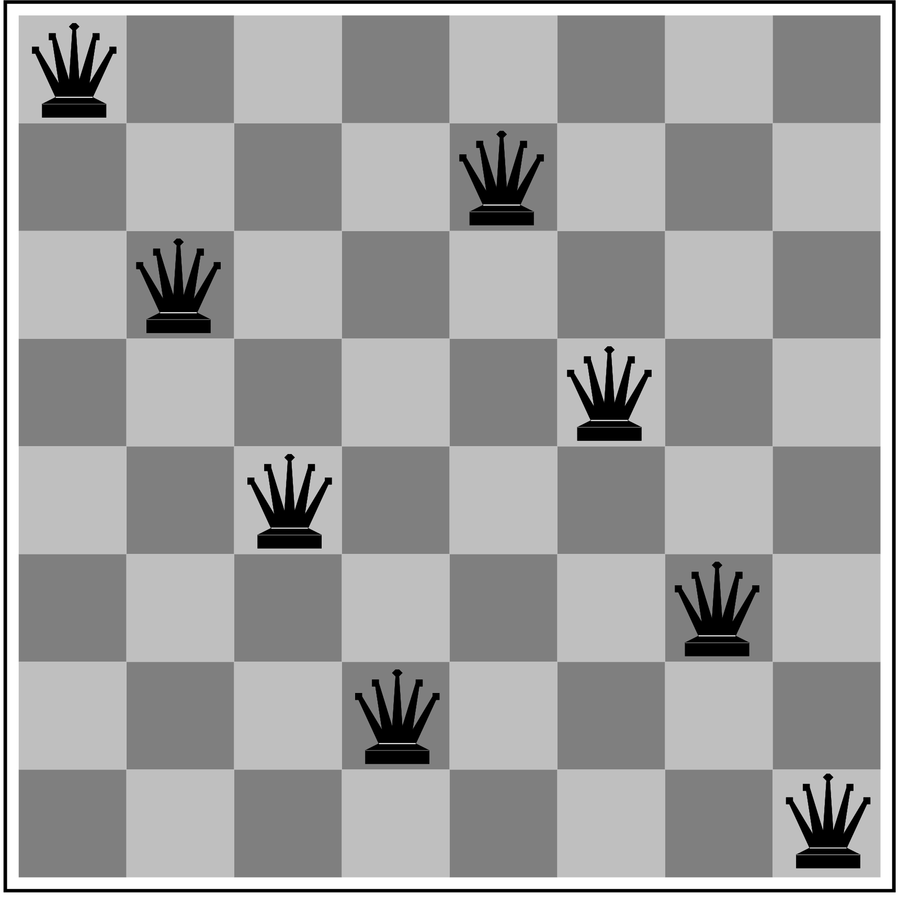

# Constraint Satisfaction Problems

## Contexto

Até agora vimos diversos problemas de planejamento. Problemas onde o agente precisava sair de um estado e chegar em outro, ou seja, sequenciar um conjunto de ações para alcançar um objetivo. 

No entanto, existem outras classes de problemas onde o objetivo não está em encontrar uma sequência de ações, mas sim em encontrar um ou mais estados que satisfazem um conjunto de restrições.

## Problema das N rainhas

Um exemplo de problema desta classe é o das **N** rainhas: dado um tabuleiro $N \times N$, é possível encontrar uma configuração onde $N$ rainhas no tabuleiro não conseguem atacar nenhuma das outras rainhas no mesmo tabuleiro?

Para tratar este tipo de problema existe uma outra classe de algoritmos. Nesta disciplina, vamos ver os seguintes algoritmos desta classe: 

* subida da montanha, e;
* subida da montanha estocástico.

Para entender o funcionamento dos algoritmos, você pode ler [este conjunto de slides](../../referencias/03_csp/csp.pdf).

## Atividade de implementação

Para esta atividade vamos utilizar o projeto [AI Code](https://github.com/Insper/ai_code). Mais especificamente, os algoritmos implementados em [CSPAlgorithms.py](https://github.com/Insper/ai_code/blob/main/src/aicode/search/CSPAlgorithms.py) e a solução para o problema das **N** Rainhas em [N_QueensProblem.py](https://github.com/Insper/ai_code/blob/main/src/N_QueensProblem.py).

* O arquivo N_QueensProblem.py está incompleto. Falta implementar a **heurística** para o problema. Sendo assim, a sua primeira atividade é fazer isto.

* Depois de implementada a heurística, teste a solução com o algoritmo **SubidaMontanha** para todos os cenários, onde $4 \leq N \leq 10$. O algoritmo subida da montanha conseguiu encontrar solução para todos os casos? 

* Teste a solução com o algoritmo **SubidaMontanhaEstocastico** também para todos os cenários. Qual foi a diferença no comportamento?

## Discussão e fechamento da aula

* Você sabe explicar o motivo das respostas fornecidas pelos algoritmos **SubidaMontanha** e **SubidaMontanhaEstocastico**? 

??? warning "Mínimo ou máximo local"
    O que é mínimo ou máximo local e quais são as suas consequências? 

